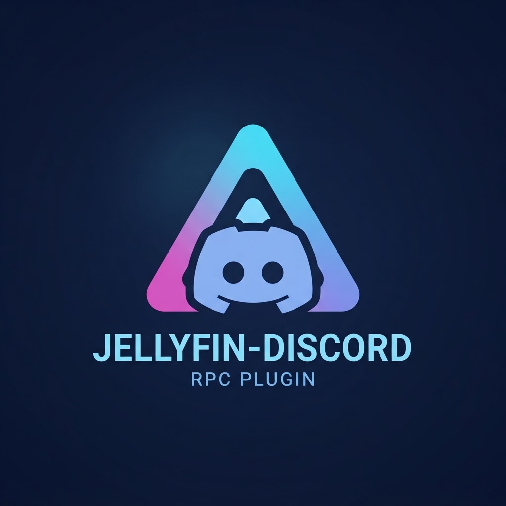

# Discord Rich Presence for Jellyfin

<p align="center">
  
</p>

[](LICENSE)
[](https://dotnet.microsoft.com/)
[](https://jellyfin.org/)

Display your **Jellyfin media playback as Discord Rich Presence activity** in real time without third-party cloud services or the Discord Social SDK.

---

## ✨ Features

- **Movies**: Shows title, current elapsed / total runtime (`MM:SS / HH:MM:SS`), and cover artwork.
- **TV Shows**: Displays series name, season and episode numbers (`S01E05 • Episode Title`), and duration.
- **Music**: Shows track title, artist name (`♫ Artist`), album artwork, and listening progress.
- **Event-Driven Lifecycle**: Directly hooks Jellyfin's `ISessionManager` events (`PlaybackStart`, `PlaybackProgress`, `PlaybackStopped`) with background polling fallback for minimal resource usage.
- **🔒 Privacy First**:
  - **Zero Telemetry**: No user tracking, analytics, or external logging.
  - **Local IPC Only**: Communicates directly through local Named Pipes (Windows: `\\.\pipe\discord-ipc-0`) or Unix Domain Sockets (Linux/macOS: `/run/user/<uid>/discord-ipc-0`).
  - **No Cloud Dependencies**: Never connects to third-party endpoints or cloud RPC relays.
- **Official Jellyfin Web Dashboard**: Settings page directly integrated inside the Jellyfin Server Administration panel.

---

## 🛠️ Architecture

```
┌─────────────────────────────────────────────────────────────┐
│                       Jellyfin Server                       │
│                                                             │
│   ISessionManager ────> SessionMonitor (IHostedService)     │
│                               │                             │
│                               ▼                             │
│                       ActivityBuilder                       │
│                               │                             │
│                               ▼                             │
│                       DiscordIpcClient                      │
└───────────────────────────────┬─────────────────────────────┘
                                │ Local IPC (Named Pipe / Unix Socket)
                                ▼
┌─────────────────────────────────────────────────────────────┐
│                    Discord Desktop Client                   │
│                     (Running on same host)                  │
│                                                             │
│               User Profile: "Watching on Jellyfin"          │
└─────────────────────────────────────────────────────────────┘
```

---

## 🚀 Installation

### Method 1: Via Jellyfin Plugin Repository (Recommended)

1. Open your Jellyfin Web Interface.
2. Navigate to **Administration Dashboard** ➔ **Plugins** ➔ **Repositories** tab.
3. Click the **+ (Add)** button to add a new repository:
   - **Repository Name**: `Discord Rich Presence`
   - **Repository URL**: 
     ```
     https://raw.githubusercontent.com/Pankyop/rich-presence-for-jellyfin-in-discord-Plugin/main/manifest.json
     ```
4. Click **Save**.
5. Switch to the **Catalog** tab in Plugins.
6. Click on **Discord Rich Presence** and select **Install**.
7. **Restart your Jellyfin server** to load the plugin assembly.

### Method 2: Manual Installation (Release ZIP)

1. Download the latest `jellyfin-discord-rich-presence.zip` from the [Releases](https://github.com/Pankyop/rich-presence-for-jellyfin-in-discord-Plugin/releases) page.
2. Extract the archive into your Jellyfin plugins directory:
   - **Windows**: `%ProgramData%\Jellyfin\Server\plugins\DiscordRichPresence\`
   - **Linux**: `/var/lib/jellyfin/plugins/DiscordRichPresence/`
   - **Docker**: `<config-volume>/plugins/DiscordRichPresence/`
3. Restart your Jellyfin server.

For detailed instructions, see [docs/INSTALLATION.md](docs/INSTALLATION.md).

---

## ⚙️ Configuration

1. In the Jellyfin Admin Dashboard, click **Plugins** in the sidebar.
2. Click **Discord Rich Presence** to access settings.
3. Configure your preferences:
   - **Enable Discord Rich Presence**: Toggle integration on or off.
   - **Discord Application ID**: Your custom Discord Application ID (or use default).
   - **Poll Interval**: Session inspection rate (default: 5 seconds).
   - **Display Season/Episode numbers**: Toggle `SxxExx` formatting.
   - **Display media banner/artwork**: Toggle artwork poster rendering.
   - **Display elapsed playback time**: Toggle duration display.
4. Click **Save Settings**.

For complete configuration options, see [docs/CONFIGURATION.md](docs/CONFIGURATION.md).

---

## 🔨 Building from Source

### Prerequisites
- [.NET 8.0 SDK](https://dotnet.microsoft.com/download/dotnet/8.0)
- Python 3.9+ (for packaging script)

### Build Steps

```bash
# Clone the repository
git clone https://github.com/Pankyop/rich-presence-for-jellyfin-in-discord-Plugin.git
cd rich-presence-for-jellyfin-in-discord-Plugin

# Compile and package release zip
python scripts/build.py
```

The output zip file will be generated in `dist/jellyfin-discord-rich-presence.zip` with its SHA256 checksum printed to the console.

---

## 📄 License

This project is licensed under the [MIT License](LICENSE).
